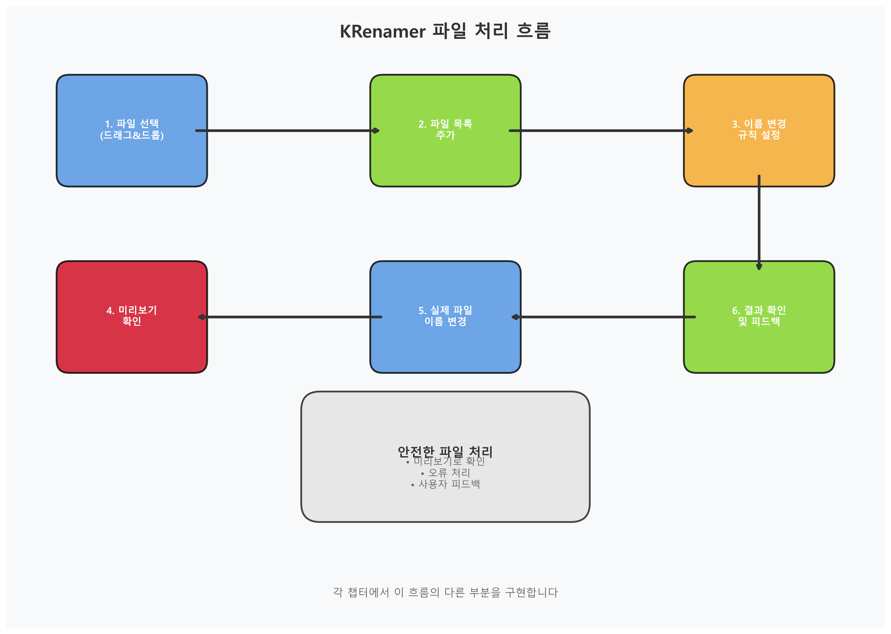

# Getting Started

이 가이드를 통해 개발 환경을 설정하고 첫 번째 예제를 실행해보겠습니다.

## 🔧 개발 환경 설정

### 1. Python 설치 확인

먼저 Python이 올바르게 설치되어 있는지 확인합니다:

```bash
python --version
```

!!! success "Python 3.8+"
    Python 3.8 이상이 필요합니다. 구버전을 사용 중이시라면 [python.org](https://python.org)에서 최신 버전을 다운로드하세요.

### 2. 필요한 패키지 설치

프로젝트에 필요한 패키지들을 설치합니다:

```bash
# 드래그 앤 드롭 기능을 위한 패키지
pip install tkinterdnd2

# 문서화를 위한 패키지 (선택사항)
pip install mkdocs mkdocs-material
```

### 3. 프로젝트 구조 확인

완성된 프로젝트의 구조는 다음과 같습니다:

```
krenamer/
├── src/
│   ├── krenamer-ch1/        # Chapter 1: Python 기초
│   │   └── main.py
│   ├── krenamer-ch2/        # Chapter 2: Tkinter GUI 기초
│   │   └── main.py
│   ├── krenamer-ch3/        # Chapter 3: 기본 GUI 구조
│   │   └── main.py
│   ├── krenamer-ch4/        # Chapter 4: 드래그 앤 드롭
│   │   └── main.py
│   └── krenamer/            # 최종 완성 버전
│       ├── __init__.py
│       ├── core.py
│       ├── gui.py
│       └── main.py
├── docs/                   # 전자책 문서
├── pyproject.toml         # 패키지 설정
└── README.md
```

## 🎯 첫 번째 예제 실행

### Chapter 1 예제 실행하기

가장 기본적인 GUI 예제부터 시작해보겠습니다:

```bash
# Chapter 1 디렉토리로 이동
cd src/krenamer-ch1

# 예제 실행
python main.py
```

정상적으로 실행되면 다음과 같은 창이 나타납니다:


### 기본 기능 테스트

1. **파일 추가**: "파일 추가" 버튼을 클릭하면 예시 파일들이 목록에 추가됩니다
2. **파일 제거**: 목록에서 파일을 선택하고 "파일 제거" 버튼으로 제거할 수 있습니다
3. **이름 변경**: "이름 변경" 버튼을 누르면 아직 구현되지 않았다는 메시지가 표시됩니다

!!! tip "예제 탐색"
    각 챕터별로 예제를 실행해보면서 기능이 어떻게 발전해나가는지 확인해보세요!

## 🔍 코드 구조 이해



### Chapter 1의 핵심 코드

Chapter 1 예제의 주요 구성 요소를 살펴보겠습니다:

=== "클래스 구조"
    ```python
    class BasicRenamerGUI:
        def __init__(self):
            self.root = tk.Tk()
            self.setup_window()
            self.setup_widgets()
        
        def setup_window(self):
            # 윈도우 기본 설정
        
        def setup_widgets(self):
            # GUI 위젯 배치
        
        def run(self):
            self.root.mainloop()
    ```

=== "윈도우 설정"
    ```python
    def setup_window(self):
        self.root.title("KRenamer - Chapter 1: Basic GUI")
        self.root.geometry("600x400")
        self.root.resizable(True, True)
        self.center_window()
    ```

=== "위젯 배치"
    ```python
    def setup_widgets(self):
        # 메인 프레임
        main_frame = ttk.Frame(self.root, padding="10")
        main_frame.grid(row=0, column=0, sticky=(tk.W, tk.E, tk.N, tk.S))
        
        # 타이틀, 리스트박스, 버튼들...
    ```

### 학습 포인트

!!! info "tkinter 기본 개념"
    - **위젯 (Widget)**: GUI의 구성 요소 (버튼, 라벨, 텍스트박스 등)
    - **레이아웃 매니저**: 위젯 배치 방식 (grid, pack, place)
    - **이벤트 처리**: 사용자 입력에 대한 반응 처리

## 🎨 GUI 디자인 원칙

### 1. 사용자 친화적 인터페이스

```python
# 직관적인 버튼 텍스트
add_button = ttk.Button(button_frame, text="파일 추가", command=self.add_files)
remove_button = ttk.Button(button_frame, text="파일 제거", command=self.remove_files)
rename_button = ttk.Button(button_frame, text="이름 변경", command=self.rename_files)
```

### 2. 반응형 레이아웃

```python
# 그리드 가중치 설정으로 창 크기 변경에 대응
main_frame.columnconfigure(0, weight=1)
self.root.columnconfigure(0, weight=1)
self.root.rowconfigure(0, weight=1)
main_frame.rowconfigure(2, weight=1)  # 리스트박스가 확장됨
```

### 3. 상태 피드백

```python
# 상태바를 통한 사용자 피드백
self.status_var = tk.StringVar()
self.status_var.set("준비됨")
status_label = ttk.Label(main_frame, textvariable=self.status_var)
```

## 🚀 다음 단계

Chapter 1의 기본 GUI를 이해했다면, 이제 [Chapter 2](chapter2.md)로 넘어가서 드래그 앤 드롭 기능을 추가해보겠습니다!

### 각 챕터별 학습 목표

| 챕터 | 주요 학습 내용 | 예상 소요 시간 |
|------|----------------|----------------|
| [Chapter 1](chapter1.md) | tkinter 기본, 레이아웃, 이벤트 | 30분 |
| [Chapter 2](chapter2.md) | 드래그 앤 드롭, 파일 처리 | 45분 |
| [Chapter 3](chapter3.md) | 파일명 변경 로직, 미리보기 | 60분 |
| [Chapter 4](chapter4.md) | 고급 조건, 정규식, 필터링 | 90분 |
| [최종 완성](final.md) | 패키지화, 배포, 최적화 | 60분 |

---

!!! question "문제가 발생했나요?"
    예제 실행 중 문제가 발생하면 [문제해결 가이드](troubleshooting.md)를 참고하세요.

!!! tip "효과적인 학습법"
    - 각 예제를 직접 타이핑해보세요
    - 코드를 수정해보면서 어떤 변화가 일어나는지 관찰하세요
    - 이해되지 않는 부분은 Python 문서를 참조하세요